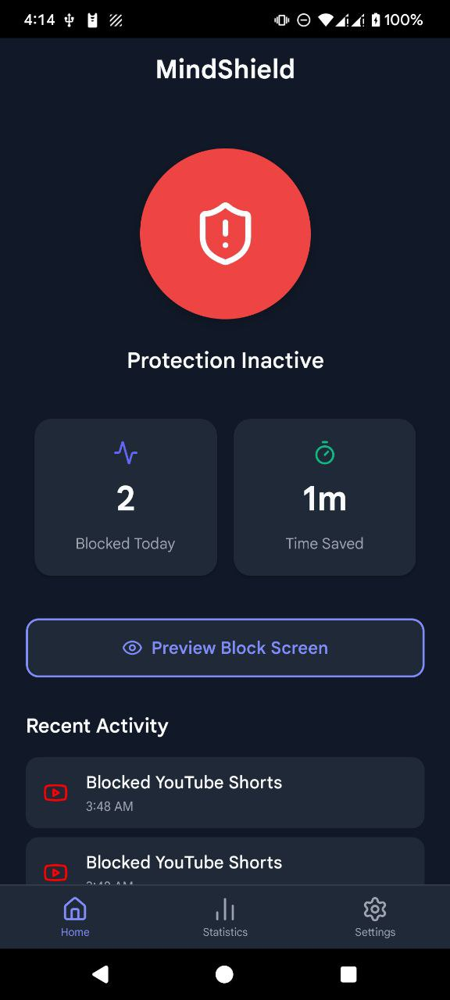
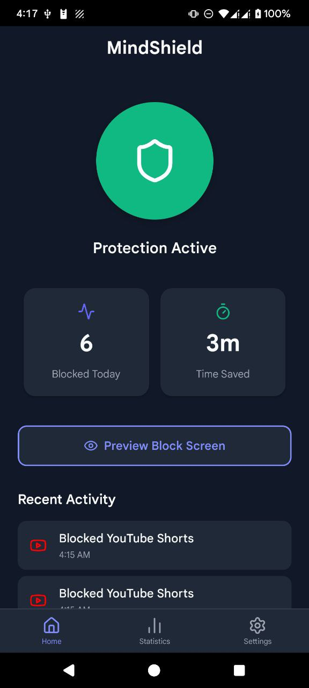
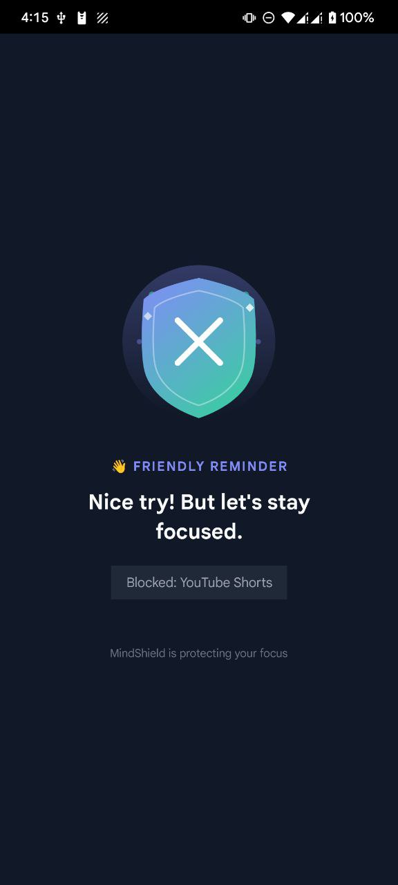
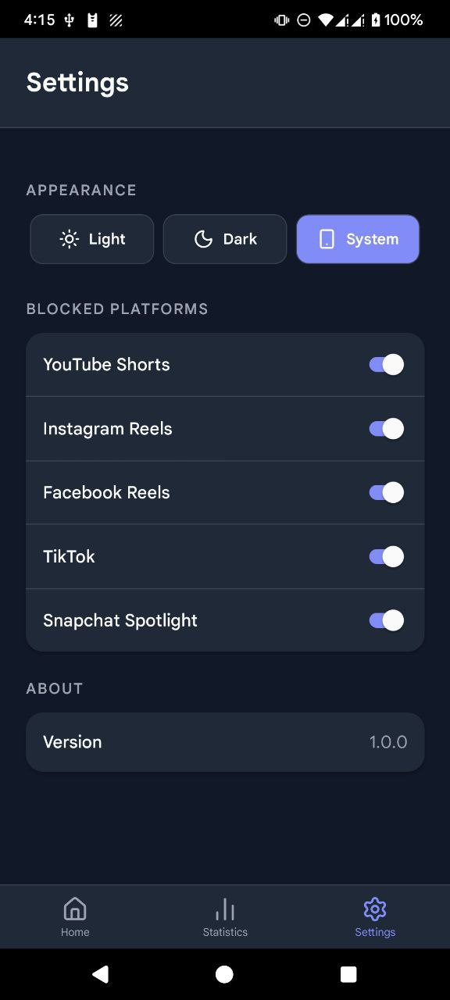
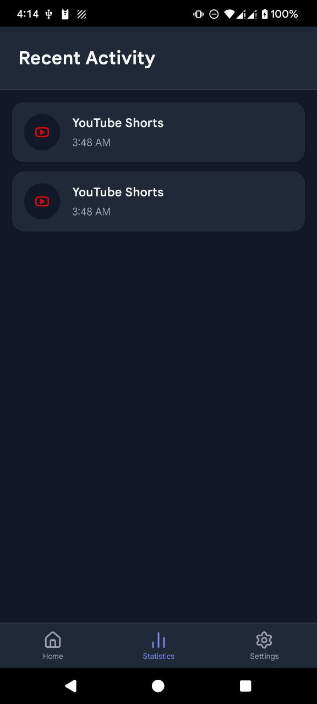

<div align="center">

<!-- Animated Banner -->
<picture>
  <source media="(prefers-color-scheme: dark)" srcset="docs/assets/banner.svg">
  <source media="(prefers-color-scheme: light)" srcset="docs/assets/banner.svg">
  
</picture>

<br/>

<!-- Logo


<br/> -->

<!-- Badges -->
[](https://www.android.com/)
[](https://reactnative.dev/)
[](https://www.typescriptlang.org/)
[](LICENSE)

[](https://github.com/swadhinbiswas/MindShield/stargazers)
[](https://github.com/swadhinbiswas/MindShield/network/members)
[](https://github.com/swadhinbiswas/MindShield/issues)
[](https://github.com/swadhinbiswas/MindShield/releases)

<h3>🛡️ Take Back Control of Your Digital Life</h3>

<p align="center">
  <strong>MindShield</strong> is a powerful Android app that blocks short-form video content<br/>
  across major social media platforms, helping you stay focused and productive.
</p>

[📱 Download APK](https://github.com/swadhinbiswas/MindShield/releases/latest) •
[🌐 Website](https://swadhinbiswas.github.io/MindShield) •
[📖 Documentation](#-documentation) •
[🐛 Report Bug](https://github.com/swadhinbiswas/MindShield/issues)

</div>

---

## 🎯 The Problem

Short-form videos are designed to be **addictive**. Apps like YouTube Shorts, Instagram Reels, and TikTok use sophisticated algorithms to keep you scrolling endlessly. Studies show:

- 📊 **Average user spends 95+ minutes/day** on short-form video platforms
- 🧠 **Decreased attention span** and difficulty focusing on long-form content
- 😰 **Increased anxiety and FOMO** from constant social media consumption
- ⏰ **Lost productivity** at work and in personal life

## 💡 The Solution

**MindShield** acts as your digital guardian, automatically detecting and blocking short-form video content before you get sucked into the endless scroll. It uses Android's Accessibility Service to monitor app activity and intervene when you access addictive content.

---

## ✨ Features

<table>
<tr>
<td width="50%">

### 🚫 Smart Content Blocking
- **YouTube Shorts** - Block shorts while keeping regular videos accessible
- **Instagram Reels** - Stop the endless reel scroll
- **Facebook Reels** - Prevent Facebook video addiction  
- **TikTok** - Complete TikTok blocking
- **Snapchat Spotlight** - Block spotlight content
- **ReVanced Support** - Works with YouTube ReVanced/Vanced

</td>
<td width="50%">

### 📊 Statistics & Insights
- **Daily block counter** - See how many distractions were prevented
- **Time saved calculator** - Track time saved from not scrolling
- **Activity history** - Review your blocking activity
- **Platform breakdown** - Know which apps distract you most

</td>
</tr>
<tr>
<td width="50%">

### 🎨 Beautiful UI/UX
- **Modern Material Design** - Clean, intuitive interface
- **Dark/Light Theme** - System-aware theme switching
- **Random Motivational Messages** - Get encouraged when content is blocked
- **Animated Shield Protection** - Visual feedback when protection is active

</td>
<td width="50%">

### ⚙️ Customization
- **Per-platform toggles** - Choose which platforms to block
- **One-tap protection** - Enable/disable with a single tap
- **Persistent protection** - Runs in background
- **Battery efficient** - Minimal battery impact

</td>
</tr>
</table>

---

## 📸 Screenshots

<div align="center">
<table>
<tr>
<td align="center"><strong>🏠 Home Screen</strong></td>
<td align="center"><strong>✅ Protection Active</strong></td>
<td align="center"><strong>🚫 Blocking Screen</strong></td>
</tr>
<tr>
<td></td>
<td></td>
<td></td>
</tr>
<tr>
<td align="center"><strong>⚙️ Settings</strong></td>
<td align="center"><strong>📊 Statistics</strong></td>
<td align="center"></td>
</tr>
<tr>
<td></td>
<td></td>
<td></td>
</tr>
</table>
</div>

---

## 🚀 Quick Start

### Download & Install

1. **Download** the latest APK from [Releases](https://github.com/swadhinbiswas/MindShield/releases/latest)
2. **Install** the APK on your Android device
3. **Grant** Accessibility Service permission when prompted
4. **Enable** protection and start focusing!

### Build from Source

```bash
# Clone the repository
git clone https://github.com/swadhinbiswas/MindShield.git
cd MindShield/FocusGuard

# Install dependencies
npm install

# Build release APK
cd android && ./gradlew assembleRelease

# APK location: android/app/build/outputs/apk/release/app-release.apk
```

---

## 📖 Documentation

### How It Works

MindShield uses Android's **Accessibility Service** to monitor screen content. When you navigate to short-form video sections in supported apps, it:

1. 🔍 **Detects** the presence of short-form video content
2. 🛑 **Blocks** the content with an overlay screen
3. 💪 **Displays** a motivational message to encourage you
4. 📝 **Logs** the block for your statistics

### Blocking Messages

MindShield shows random encouraging messages when blocking content:

| Category | Example Messages |
|----------|-----------------|
| 🛡️ **Firm** | "Focus! No scrolling right now." • "MindShield activated: Stay on task." |
| 👋 **Friendly** | "Hey there! Let's give your brain a break." • "Oops! You hit the distraction wall." |
| 💪 **Motivational** | "Your time is precious. Protect it!" • "Champions don't get distracted. Be one!" |

### Supported Apps

| App | Package Name | Content Blocked |
|-----|--------------|-----------------|
| YouTube | `com.google.android.youtube` | Shorts section |
| YouTube ReVanced | `app.revanced.android.youtube` | Shorts section |
| YouTube Vanced | `com.vanced.android.youtube` | Shorts section |
| Instagram | `com.instagram.android` | Reels section |
| Facebook | `com.facebook.katana` | Reels section |
| TikTok | `com.zhiliaoapp.musically` | All content |
| Snapchat | `com.snapchat.android` | Spotlight section |

---

## 🏗️ Tech Stack

<div align="center">

| Technology | Purpose |
|------------|---------|
|  | Cross-platform UI framework |
|  | Type-safe JavaScript |
|  | State management |
|  | Local database |
|  | Native Android features |

</div>

### Project Structure

```
FocusGuard/
├── 📱 src/
│   ├── 🧭 navigation/      # App navigation
│   ├── 📺 screens/         # UI screens
│   ├── 🔧 services/        # Business logic
│   ├── 📦 store/           # State management
│   └── 🎨 theme/           # Theming
├── 🤖 android/
│   └── app/src/main/java/  # Native Android code
│       ├── BlockingAccessibilityService.java
│       ├── BlockOverlayManager.java
│       └── BlockingModule.java
└── 📄 assets/              # Images & resources
```

---

## 🤝 Contributing

We welcome contributions! Here's how you can help:

1. 🍴 **Fork** the repository
2. 🌿 **Create** a feature branch (`git checkout -b feature/amazing-feature`)
3. 💻 **Commit** your changes (`git commit -m 'Add amazing feature'`)
4. 📤 **Push** to the branch (`git push origin feature/amazing-feature`)
5. 🔃 **Open** a Pull Request

### Development Setup

```bash
# Install dependencies
npm install

# Start Metro bundler
npm start

# Run on Android (debug)
npm run android

# Run tests
npm test
```

---

## 📋 Roadmap

- [x] Core blocking functionality
- [x] YouTube Shorts blocking
- [x] Instagram Reels blocking
- [x] TikTok blocking
- [x] ReVanced/Vanced support
- [x] Statistics tracking
- [x] Theme support
- [ ] Scheduled blocking (e.g., work hours only)
- [ ] Focus mode with timer
- [ ] Widget support
- [ ] Whitelist specific videos
- [ ] iOS version
- [ ] Weekly/monthly reports
- [ ] Cloud sync

---

## ❓ FAQ

<details>
<summary><strong>Is MindShield safe to use?</strong></summary>

Yes! MindShield only monitors app content to detect short-form videos. It doesn't collect or transmit any personal data. All statistics are stored locally on your device.
</details>

<details>
<summary><strong>Why does it need Accessibility Service permission?</strong></summary>

The Accessibility Service is the only way Android allows apps to monitor and interact with content in other apps. MindShield uses this to detect when you're viewing short-form videos.
</details>

<details>
<summary><strong>Will it drain my battery?</strong></summary>

MindShield is designed to be battery-efficient. It only actively monitors supported apps and sleeps otherwise. Most users report negligible battery impact.
</details>

<details>
<summary><strong>Can I still watch regular YouTube videos?</strong></summary>

Yes! MindShield only blocks the Shorts section. Regular YouTube videos, playlists, and subscriptions work normally.
</details>

---

## 📄 License

This project is licensed under the **MIT License** - see the [LICENSE](LICENSE) file for details.

---

## 🙏 Acknowledgments

- [React Native](https://reactnative.dev/) - Amazing cross-platform framework
- [Lucide Icons](https://lucide.dev/) - Beautiful icon set
- [Zustand](https://github.com/pmndrs/zustand) - Simple state management
- All contributors and users who help improve MindShield!

---

<div align="center">

### ⭐ Star this repo if MindShield helps you stay focused!

<br/>

**Made with ❤️ for a more focused world**

<br/>

[](https://github.com/swadhinbiswas)

</div>
