# 🛡️ Project Report: FocusGuard

> [!INFO] **Course Details**
> **Course:** Mobile Application Design (MAD)
> **Semester:** Fall/Spring 2025 <!-- Update Semester -->
> **Section:** <!-- Update Section -->
> **Instructor:** <!-- Update Instructor Name -->

---

## 👥 Group Members

| Name | Student ID | Role |
| :--- | :--- | :--- |
| **[Member 1 Name]** | *[ID]* | Team Lead / Backend |
| **[Member 2 Name]** | *[ID]* | UI/UX Designer |
| **[Member 3 Name]** | *[ID]* | Frontend Developer |
| **[Member 4 Name]** | *[ID]* | Research & Documentation |

---

## 📝 1. Abstract

**FocusGuard** is a cutting-edge mobile application designed to combat the rising tide of digital distraction and social media addiction. In an ecosystem dominated by algorithmic feed loops—such as **YouTube Shorts, Instagram Reels, and TikTok**—users find it increasingly difficult to maintain attention.

FocusGuard empowers users to **regain control** over their digital wellbeing by specifically targeting these high-dopamine loops without completely restricting access to the platforms themselves. Built with **Flutter** for a seamless cross-platform experience and integrated with **Native Android Accessibility Services** for robust content detection, FocusGuard offers a comprehensive solution featuring real-time blocking, granular insights, and customizable protection profiles.

> [!SUCCESS] **Key Achivement**
> Unlike traditional blockers that disable an entire app, FocusGuard uses "surgical" blocking to strictly disable the *addictive* features (Reels/Shorts) while keeping messaging and utility features operational.

---

## 🎯 2. Problem Statement & Project Scope

### 🔴 Problem Statement
The proliferation of short-form video content has led to a widely recognized decrease in attention spans and productivity. The "Doomscrolling" mechanism exploits psychological vulnerabilities, creating a variable reward schedule that keeps users hooked.
*   **The Gap:** Existing solutions are too binary—they either block the app entirely (hampering communication) or do nothing at all.
*   **The Need:** A tool that understands the *context* of usage—differentiating between replying to a message on Instagram vs. mindless scrolling on Reels.

### 🔭 Project Scope
FocusGuard aims to bridge this gap by providing:
1.  **Granular Blocking:** Specifically detecting and closing short-form video players within major social media apps (YouTube, Instagram, Facebook, TikTok, Snapchat).
2.  **Usage Insights:** Visualizing the number of "scrolls" or block events to make users aware of their subconscious habits.
3.  **User Autonomy:** Allowing users to toggle protection for individual platforms.
4.  **Cross-Platform UI:** A consistent, fluid, and responsive interface using Flutter.

---

## 👥 3. Targeted Users (EP6)

The application comprehensively addresses the needs of diverse stakeholder groups:

*   🎓 **Students:** Who need to focus on academic goals but often fall into "study break" traps that last hours.
*   💼 **Remote Workers:** Who rely on their devices for workflow communication and cannot afford the "digital detox" approach of blocking everything.
*   👨‍👩‍👧 **Parents:** Who want to safeguard their children from the "slot machine" mechanics of social media algorithms.
*   🧘 **Minimalists:** Individuals actively seeking tools to practice intentional technology use.

> [!TIP] **Stakeholder Interaction Summary**
> During our requirement gathering, a key insight from user interviews was: *"I don't want to unwantedly block my friends, I just want to stop wasting time."* This pivoting feedback (EP6) drove our architectural decision to use **Accessibility Services** for content inspection rather than simple package-level blocking.

---

## 🎨 4. UI/UX Design

The application follows **Material Design 3 (Material You)** principles to ensure a modern, intuitive, and highly accessible user experience.

### Design Principles
*   ✨ **Aesthetics:** Clean, distraction-free interface using huge whitespace and rounded corners.
*   🔄 **Consistency:** Uniform navigation patterns and iconography (using `Lucide` icons).
*   📱 **Responsiveness:** Adaptive layouts that function seamlessly on devices of varying aspect ratios.
*   🌗 **Theming:** Full support for **System**, **Light**, and **Dark** modes.

### Wireframes & Mockups
> [!NOTE] Design Visuals
> *[Place Screenshot of Figma/Sketch Wireframes here]*

### ♿ Accessibility Consideration
*   **High Contrast:** Strict adherence to WCAG guidelines for text contrast.
*   **Scalable Text:** UI elements dynamically adjust to system font size settings.
*   **Haptic Feedback:** Subtle vibrations confirm toggle actions, aiding users with visual impairments.

---

## 🏗️ 5. System Architecture

FocusGuard employs a **Hybrid Architecture** leveraging the best of Flutter for UI and Native Android for deep system integration.

### Tech Stack
    

*   **Presentation Layer (Flutter):** Handles UI rendering, user interaction, animations, and state visualization.
*   **Logic Layer (Dart/Providers):** Manages application state, business logic, and the communication bridge.
*   **Data Layer (SQFlite/SharedPrefs):** Persists user settings and blocking history locally on the secure storage.
*   **Native Layer (Android Accessibility Service):** The "Engine Room" that runs in the background, inspecting UI hierarchy nodes of target apps to detect specific keywords (e.g., "Reels", "Shorts") and performing the `GLOBAL_ACTION_BACK` to exit the content.

### 🗺️ Navigation Chart
The app uses a persistent bottom navigation bar for the main user flow:

```mermaid
graph TD
    A[Login Screen] -->|Auth Success| B[Main Screen]
    subgraph "Main Screen Tabs"
    B --> C[🏠 Home]
    B --> D[📊 Statistics]
    B --> E[⚙️ Settings]
    end
    C -->|One-Tap| F[Toggle Protection]
    E -->|Manage| G[Account & Theme]
```

---

## ⚡ 6. State Management Approach (EP3)

We utilized **Provider** for state management to ensure a reactive and performant application.

> [!QUESTION] **Why Provider?**
> We analyzed `setState` (too simple/messy for global state), `BLoC` (too much boilerplate), and `GetX` (non-standard). **Provider** was the optimal choice for:
> *   **Performance:** Efficiently rebuilds only the widgets that need updating (e.g., the 'Blocked Count' text) without repainting the whole screen.
> *   **Scalability:** Allows distinct separation of Business Logic (BlockingProvider) from UI code.

**Implementation Highlight:**
The `BlockingProvider` acts as the "Central Nervous System", listening to the native `EventChannel`. When the Android service detects a Short, it sends a signal; the Provider updates the `_blockedToday` counter, and the UI updates instantly—providing that satisfying "real-time" feedback loop.

---

## 🚀 7. Feature List & Implementation Details

### 1. 🛡️ The Dashboard (Home)
*   **Master Toggle:** A prominent, pulsating button to enable/disable protection.
*   **Live Counter:** Shows "Distractions Blocked Today" in real-time.
*   **Platform Pills:** Quick-toggle chips to customize which apps to block (e.g., Block TikTok but allow YouTube).

### 2. 📊 Statistics Hub
*   **Visual Charts:** Uses `fl_chart` to render beautiful bar charts showing distraction attempts over the last 7 days.
*   **Activity Log:** A chronological list of interception events (e.g., "Blocked Instagram Reels at 10:42 AM").

### 3. ⚙️ Settings & Customization
*   **Theme Engine:** Deep customization allowing users to sync with system dark mode.
*   **Privacy Controls:** Clear linking to privacy policies and data handling info.

### 4. 🔐 Secure Authentication
*   **Firebase Integration:** Robust Google Sign-In implementation to secure user identity and prepare for future cloud-sync features (e.g., syncing stats across devices).

> *[Place Screenshots Here: Organize them in a 2x2 grid if possible for a cleaner look]*

---

## 💾 8. Data Management

### 🗄️ Local Database (SQFlite)
We use `sqflite` for robust, relational data storage. This ensures data **privacy** as usage logs remain 100% on the device.

**Schema: `block_events`**
| Column | Type | Description |
| :--- | :--- | :--- |
| `id` | `INTEGER PK` | Auto-incrementing unique identifier |
| `platform` | `TEXT` | App ID (e.g., `com.instagram.android`) |
| `timestamp` | `INTEGER` | Unix epoch time for precise analytics |

### 🔧 Preferences
`Shared Preferences` handles lightweight configuration flags:
*   `block_youtube_shorts`: `true/false`
*   `theme_mode`: `0 (System) | 1 (Light) | 2 (Dark)`

---

## 🏎️ 9. Performance Optimizations (EP1)

*   **Lazy Loading:** Statistics lists use `ListView.builder`, rendering only visible items to ensure 60fps scrolling even with thousands of log entries.
*   **Bridge Efficiency:** The `MethodChannel` communication is optimized to be **event-driven**. The Flutter app does *not* poll the native side; instead, the native side "pushes" updates only when necessary, saving battery life.
*   **Asset Optimization:** All vector icons (`Lucide`) are font-based rather than image-based to reduce app bundle size.

---

## 📋 10. Engineering Principles (EP) Analysis

### 🧠 EP1 – Depth of Knowledge
The project required mastering **system-level Android APIs** (AccessibilityNodeInfo) and bridging them to a high-level UI framework. We dealt with critical concurrency issues—ensuring the UI thread never freezes while the background service processes complex node hierarchies.

### ⚖️ EP2 – Conflicting Requirements
> [!WARNING] **Conflict: Privacy vs. Functionality**
> *   **Issue:** To block content, the app technically "reads" the screen, which is a massive privacy concern.
> *   **Resolution:** We architected a **"Local-Only" Intelligence**. No pixel data or text leaves the device. The detection logic is strictly regex-based on Accessibility Nodes, ensuring user messages/passwords are never touched.

### 🧐 EP3 – Depth of Analysis
We chose **Provider** over **Riverpod** or **Bloc** after a trade-off analysis. While Riverpod is newer, Provider's maturity and direct integration with Flutter's `InheritedWidget` system made it the most stable choice for a project relying heavily on native stream updates.

### 🌐 EP5 – Real-World Application
The app integrates a diverse tech stack:
*   **Cloud:** Firebase Auth
*   **Hardware/OS:** Android Accessibility, Haptic Feedback Engine
*   **Storage:** SQL Relational DB
*   **Async I/O:** Dart Streams and Futures

### 🤝 EP6 – Stakeholder Satisfaction
We balanced the **Parental** need for "total control" with the **Student** need for "selective usage." The solution was the **Granular Platform Toggles**, allowing a compromise where users can block *just* the most addictive app for them personally.

---

## 🚧 11. Challenges & Solutions

| Challenge | Solution |
| :--- | :--- |
| **Dynamic UI Changes** | Apps like Instagram frequently change their UI IDs. We switched to **Content Description** matching (e.g., looking for "Reels" text for accessibility) which is far more stable than ID matching. |
| **Battery Drain** | Continuous scanning is heavy. We implemented a **"App Focus Detection"**: the scanner *only* runs when a target app (e.g., TikTok) is actually in the foreground. |
| **User Onboarding** | Permissions are scary. We created a custom **Onboarding Flow** with clear animations explaining *why* we need permissions before asking for them. |

---

## 📚 12. References

1.  **Flutter Documentation:** [flutter.dev/docs](https://flutter.dev/docs)
2.  **Android Accessibility:** [developer.android.com](https://developer.android.com/reference/android/accessibilityservice/AccessibilityService)
3.  **Material Design 3:** [m3.material.io](https://m3.material.io/)
4.  **Provider Package:** [pub.dev/packages/provider](https://pub.dev/packages/provider)

---
*Generated by FocusGuard Team*
